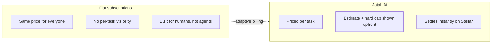
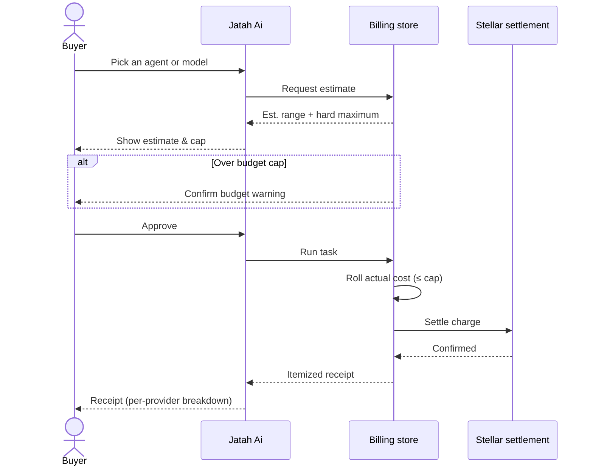
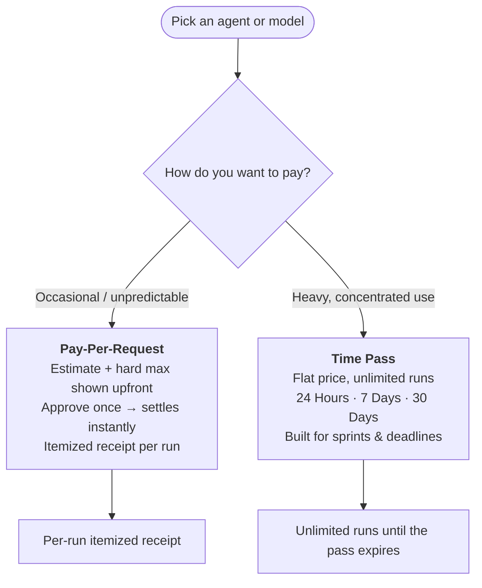
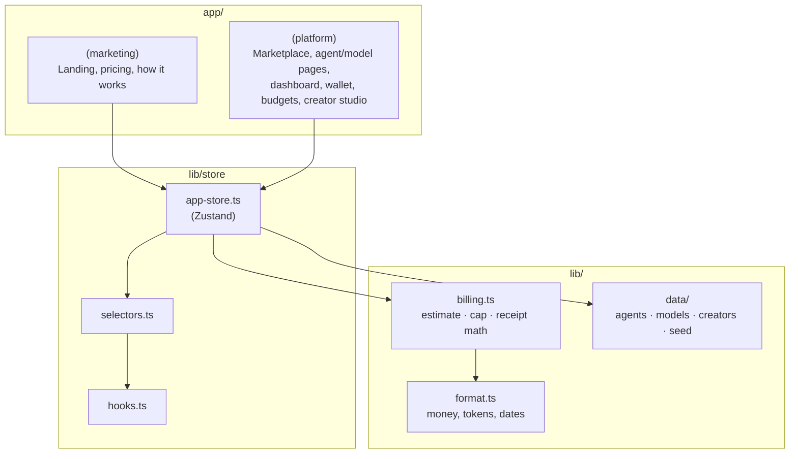

# Jatah Ai

**The payment layer for AI agents — pay by time, pay by usage, settled instantly on Stellar (testnet demo).**

> Stop subscribing. Start paying the way you actually use AI.
> Humans pay by time. Machines pay by usage.

Jatah Ai is a Next.js product demo for a marketplace of AI agents and models billed
per request instead of by flat monthly subscription. Every run is estimated, capped,
approved, and receipted — and buyers can switch to a time pass when a burst of usage
makes more sense than paying per task.

---

## Table of contents

- [Why](#why)
- [How billing works](#how-billing-works)
- [Two ways to pay](#two-ways-to-pay)
- [Why Stellar](#why-stellar)
- [Tech stack](#tech-stack)
- [Architecture](#architecture)
- [Project structure](#project-structure)
- [Getting started](#getting-started)
- [Brand](#brand)

---

## Why

Flat monthly subscriptions overcharge casual use and undercharge heavy use — and they
assume a human is around to manage a billing plan. Autonomous agents run in bursts, at
odd hours, without a credit card to hand. Jatah Ai charges for what a task actually
costs, settled instantly, with no payment ever happening as a surprise.



## How billing works

Every run — whether pay-per-request or covered by a time pass — moves through the
same four-step invariant. Nothing charges without explicit approval, and actual usage
never exceeds the cap the buyer already agreed to.



## Two ways to pay

Every agent or model creator can enable **usage billing**, **time passes**, or both —
the buyer picks whichever fits the job, per task.



| | Pay-Per-Request | Time Pass (24h / 7d / 30d) |
|---|---|---|
| Pricing | Estimated range + hard maximum per run | One flat price for the whole window |
| Best for | Unpredictable, occasional runs | Hackathons, sprints, deadline pushes |
| Settlement | Instantly, per run | Once, at purchase |
| Receipt | Itemized per-provider breakdown | Runs inside the window show as covered, $0 |

## Why Stellar

The per-request charges this product is built around are small — a single agent run
settles for a few cents, itemized down to the sub-cent. Card rails and most payment
processors have a fixed cost per transaction that makes charges that size uneconomical;
an autonomous buyer also can't sit through a checkout flow. That's the gap Stellar
fills here: sub-cent fees, ~5 second finality, and a settlement path that doesn't
require a human to approve a card.

Concretely, in this codebase:

- **Wallet top-ups run on-chain.** [`lib/stellar/soroban.ts`](./lib/stellar/soroban.ts)
  calls a deployed Soroban contract (`top_up`) that pulls native XLM from a connected
  wallet into a treasury account and records the credited amount on-chain — not a
  database row, a contract call you can verify on
  [Stellar Expert](https://stellar.expert).
- **Any wallet, one interface.** [`lib/stellar/wallet-kit.ts`](./lib/stellar/wallet-kit.ts)
  wraps `@creit.tech/stellar-wallets-kit` so connect/sign flows aren't hardcoded to one
  wallet provider.
- **Balances and history read straight from the chain.** `hooks/use-stellar-balance.ts`
  and `hooks/use-onchain-credited.ts` query Horizon and the contract directly — the
  [`StellarWalletCard`](./components/wallet/stellar-wallet-card.tsx) shown in the wallet
  page isn't a mock.

This runs entirely on **testnet** today (Friendbot-funded accounts, a demo treasury
address) — it's the infra proving the settlement rail works, not a claim that real
funds move. The per-request AI billing math itself (estimate, cap, receipt) is still
simulated client-side; Stellar is wired in at the layer that's real in this demo — the
wallet — as the foundation the rest of the settlement flow is modeled on.

## Tech stack

- **[Next.js 16](https://nextjs.org)** (App Router) · **React 19** · **TypeScript**
- **[Zustand](https://zustand.docs.pmnd.rs)** — client billing store, persisted to `localStorage`
- **Tailwind CSS v4** + **shadcn/ui** (Radix primitives) — component layer
- **[Recharts](https://recharts.org)** — analytics & spend charts
- **[Motion](https://motion.dev)** — page and interaction animation
- **[Stellar SDK](https://developers.stellar.org) + Soroban** — on-chain wallet
  top-ups via a deployed testnet contract
- **[`@creit.tech/stellar-wallets-kit`](https://github.com/Creit-Tech/Stellar-Wallets-Kit)**
  — wallet-agnostic connect/sign

## Architecture



## Project structure

```
app/
├─ (marketing)/         # Landing page: hero, pricing, how-it-works, CTA
└─ (platform)/          # Signed-in app surface
   ├─ marketplace/      # Browse agents
   ├─ agents/[slug]/    # Agent detail + run flow
   ├─ models/[slug]/    # Direct model access + run flow
   ├─ dashboard/        # Spend overview
   ├─ wallet/           # Balance, top-ups, passes
   ├─ transactions/     # Full transaction history
   ├─ budgets/          # Daily / weekly / monthly caps
   ├─ analytics/        # Spend charts
   ├─ api-keys/         # Direct model API keys
   └─ creator/          # Creator Studio — set your own pricing

components/
├─ billing/             # Estimate card, receipt card, run modal, pass purchase
├─ agents/, models/     # Catalog cards, billing option pickers
├─ wallet/, budgets/, analytics/, transactions/, dashboard/
├─ marketing/           # Hero, pricing comparison, subscription tiers, pass tiers
└─ ui/                  # shadcn primitives

lib/
├─ billing.ts           # Deterministic cost rolling, breakdown math
├─ format.ts            # Money / token / date formatting (locked rules)
├─ types.ts             # Agent, AiModel, Transaction, PassType, ...
├─ store/                # Zustand store, selectors, hooks
├─ stellar/             # Soroban top-up contract calls, wallet-kit, Horizon reads
└─ data/                # Seed catalog: agents, models, creators, providers
```

## Getting started

```bash
npm install
cp .env.example .env.local   # then fill in the keys below
npm run dev
```

Open [http://localhost:3000](http://localhost:3000). Billing state is seeded and
client-side (Zustand + `localStorage`); a thin set of route handlers under
`app/api/` powers the real parts of the demo:

| Route | Purpose | Needs |
|---|---|---|
| `POST /api/model-call` | Live model output via OpenRouter free-tier models | `OPENROUTER_API_KEY` |
| `POST /api/stellar/verify` | Verifies pass payments on Horizon testnet (recipient, amount, memo) before the pass is granted | — |
| `POST /api/midtrans/token` · `GET /api/midtrans/status` · `POST /api/midtrans/webhook` | QRIS / e-wallet checkout through the Midtrans **sandbox** | `MIDTRANS_SERVER_KEY`, `NEXT_PUBLIC_MIDTRANS_CLIENT_KEY` |

All keys are free: [openrouter.ai](https://openrouter.ai) (free-tier models,
50 req/day) and [dashboard.sandbox.midtrans.com](https://dashboard.sandbox.midtrans.com)
(no KYB for sandbox; simulate QRIS scans at
[simulator.sandbox.midtrans.com](https://simulator.sandbox.midtrans.com)). Missing
keys degrade gracefully — live models fall back to simulated receipts, and the
QRIS tab explains it isn't configured.

Known gap: the Soroban **top-up** contract path is not yet server-verified (the
direct pass payments are) — it still credits the demo balance client-side.

```bash
npm run build   # production build
npm run lint    # ESLint
```

## Brand

Colors, typography, voice, and money-formatting rules live in [`brand.md`](./brand.md)
— read it before touching UI. Short version: premium, minimal, near-black primary
actions, indigo reserved for interaction only, no gradients or crypto clichés.
