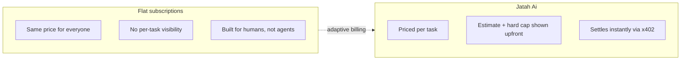
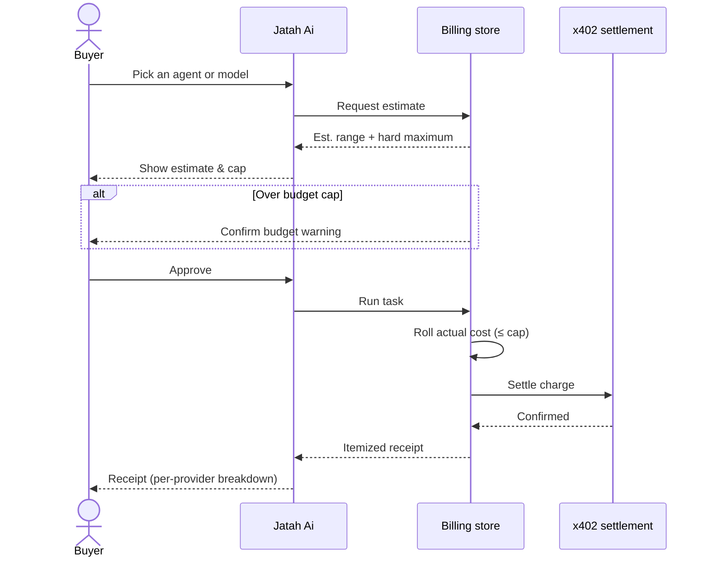
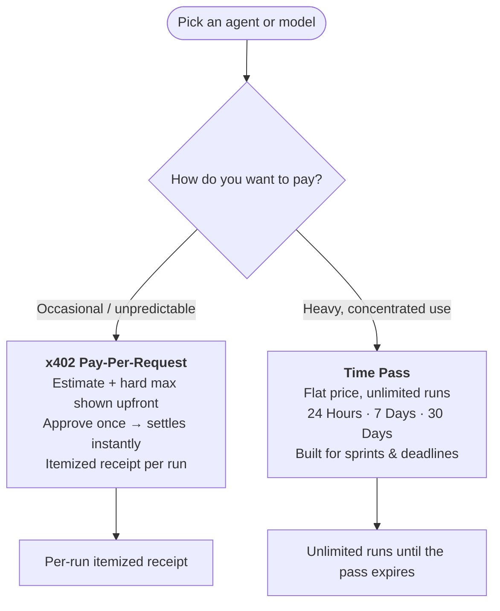
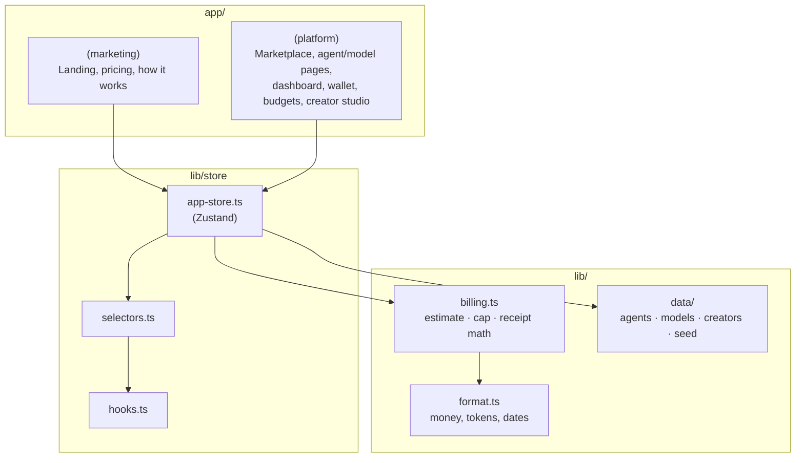

# Jatah Ai

**The payment layer for AI agents — pay by time, pay by usage, settled instantly with x402.**

> Stop subscribing. Start paying the way you actually use AI.
> Humans pay by time. Machines pay by usage.

Jatah Ai is a Next.js product demo for a marketplace of AI agents and models billed
per request instead of by flat monthly subscription. Every run is estimated, capped,
approved, and receipted — and buyers can switch to a time pass when a burst of usage
makes more sense than paying per task.

---

## Table of contents

- [Why](#why)
- [How billing works](#how-billing-works)
- [Two ways to pay](#two-ways-to-pay)
- [Tech stack](#tech-stack)
- [Architecture](#architecture)
- [Project structure](#project-structure)
- [Getting started](#getting-started)
- [Brand](#brand)

---

## Why

Flat monthly subscriptions overcharge casual use and undercharge heavy use — and they
assume a human is around to manage a billing plan. Autonomous agents run in bursts, at
odd hours, without a credit card to hand. Jatah Ai charges for what a task actually
costs, settled instantly, with no payment ever happening as a surprise.



## How billing works

Every run — whether pay-per-request or covered by a time pass — moves through the
same four-step invariant. Nothing charges without explicit approval, and actual usage
never exceeds the cap the buyer already agreed to.



## Two ways to pay

Every agent or model creator can enable **usage billing**, **time passes**, or both —
the buyer picks whichever fits the job, per task.



| | x402 Pay-Per-Request | Time Pass (24h / 7d / 30d) |
|---|---|---|
| Pricing | Estimated range + hard maximum per run | One flat price for the whole window |
| Best for | Unpredictable, occasional runs | Hackathons, sprints, deadline pushes |
| Settlement | Instantly via x402, per run | Once, at purchase |
| Receipt | Itemized per-provider breakdown | Runs inside the window show as covered, $0 |

## Tech stack

- **[Next.js 16](https://nextjs.org)** (App Router) · **React 19** · **TypeScript**
- **[Zustand](https://zustand.docs.pmnd.rs)** — client billing store, persisted to `localStorage`
- **Tailwind CSS v4** + **shadcn/ui** (Radix primitives) — component layer
- **[Recharts](https://recharts.org)** — analytics & spend charts
- **[Motion](https://motion.dev)** — page and interaction animation
- **x402** — the settlement protocol every charge in this demo models itself on

## Architecture



## Project structure

```
app/
├─ (marketing)/         # Landing page: hero, pricing, how-it-works, CTA
└─ (platform)/          # Signed-in app surface
   ├─ marketplace/      # Browse agents
   ├─ agents/[slug]/    # Agent detail + run flow
   ├─ models/[slug]/    # Direct model access + run flow
   ├─ dashboard/        # Spend overview
   ├─ wallet/           # Balance, top-ups, passes
   ├─ transactions/     # Full transaction history
   ├─ budgets/          # Daily / weekly / monthly caps
   ├─ analytics/        # Spend charts
   ├─ api-keys/         # Direct model API keys
   └─ creator/          # Creator Studio — set your own pricing

components/
├─ billing/             # Estimate card, receipt card, run modal, pass purchase
├─ agents/, models/     # Catalog cards, billing option pickers
├─ wallet/, budgets/, analytics/, transactions/, dashboard/
├─ marketing/           # Hero, pricing comparison, subscription tiers, pass tiers
└─ ui/                  # shadcn primitives

lib/
├─ billing.ts           # Deterministic cost rolling, breakdown math
├─ format.ts            # Money / token / date formatting (locked rules)
├─ types.ts             # Agent, AiModel, Transaction, PassType, ...
├─ store/                # Zustand store, selectors, hooks
└─ data/                # Seed catalog: agents, models, creators, providers
```

## Getting started

```bash
npm install
npm run dev
```

Open [http://localhost:3000](http://localhost:3000). The app runs entirely on seeded,
client-side state (Zustand + `localStorage`) — no backend or database required.

```bash
npm run build   # production build
npm run lint    # ESLint
```

## Brand

Colors, typography, voice, and money-formatting rules live in [`brand.md`](./brand.md)
— read it before touching UI. Short version: premium, minimal, near-black primary
actions, indigo reserved for interaction only, no gradients or crypto clichés.
